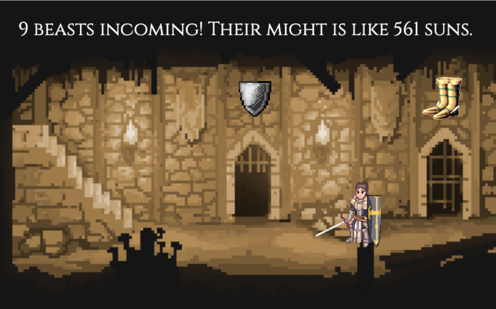

# Armor Up!

## About

Armor Up! is a fast-paced 2D game that allows players ages 12+ to hone the speed of their reactions through quick, interactive math problems.

The game offers the player only one choice each round: an item which will reduce incoming damage by a flat amount, or an item which will reduce damage by a percentage value. Simple! As the game speeds up, the player must be quick on their feet to select the right option judging on what kind of enemies are approaching.

<br />

<p align="center">
  <a href="">
    
  </a>
  <p align="center">
    <br />
    
## Prerequisites:

Armor Up! uses this Phaser3 + Parcel [template](https://github.com/ourcade/phaser3-parcel-template) created by Ourcade

You'll need [Node.js](https://nodejs.org/en/), [npm](https://www.npmjs.com/), and [Parcel](https://parceljs.org/) installed.

It is highly recommended to use [Node Version Manager](https://github.com/nvm-sh/nvm) (nvm) to install Node.js and npm.

For Windows users there is [Node Version Manager for Windows](https://github.com/coreybutler/nvm-windows).

Install Node.js and `npm` with `nvm`:

```bash
nvm install node

nvm use node
```

Replace 'node' with 'latest' for `nvm-windows`.

Then install Parcel:

```bash
npm install -g parcel-bundler
```
    
## Installing Armor Up!:

To install the game, follow these steps:
Fork and clone this repository to your local machine:

```bash
git@github.com:leorodriguez916/Stackathon.git
```

This will create a folder named `Stackathon`. You can specify a different folder name like this:

```bash
git clone git@github.com:2202-capstone-fsa/Passage.git
my-folder-name
```

Go into your new project folder and install dependencies:

```bash
cd Passage # or 'my-folder-name'
npm install
```

Start server:

```
npm run start
```

## Contact:
    
If you want to contact me you can reach me at: 
    leorodriguez916@gmail.com

Connect with me on LinkedIN at 
    https://www.linkedin.com/in/leorubenrodriguez/

